# Personal Finance Companion

A personal finance app built with Expo and React Native to help users track transactions, monitor goals, and review spending insights in a fast, mobile-first workflow.

<p>
    
    
    
    
    
</p>

## What This App Covers

- Daily transaction tracking (income and expense)
- Category-level spending insights and chart views
- Savings goals and challenge cards
- Biometric protection for app access and secure export actions
- Investment planning flow with manual strategy generation
- US and India market watchlist cards with local pricing context

## Screenshots

All screenshots below are pulled directly from the local repository under the img folder.

### Light Theme

| Home                              | Ledger                                | Insights                                  |
| --------------------------------- | ------------------------------------- | ----------------------------------------- |
| 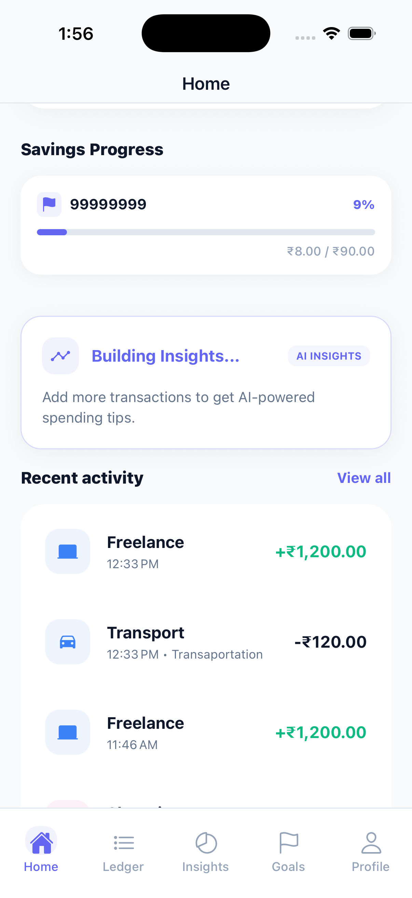 | 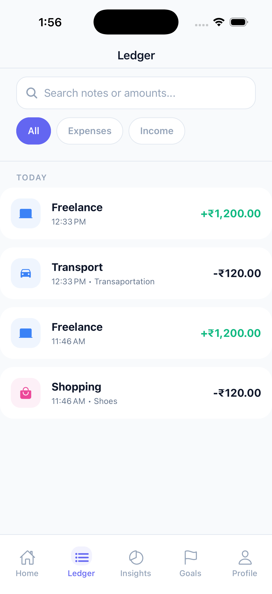 | 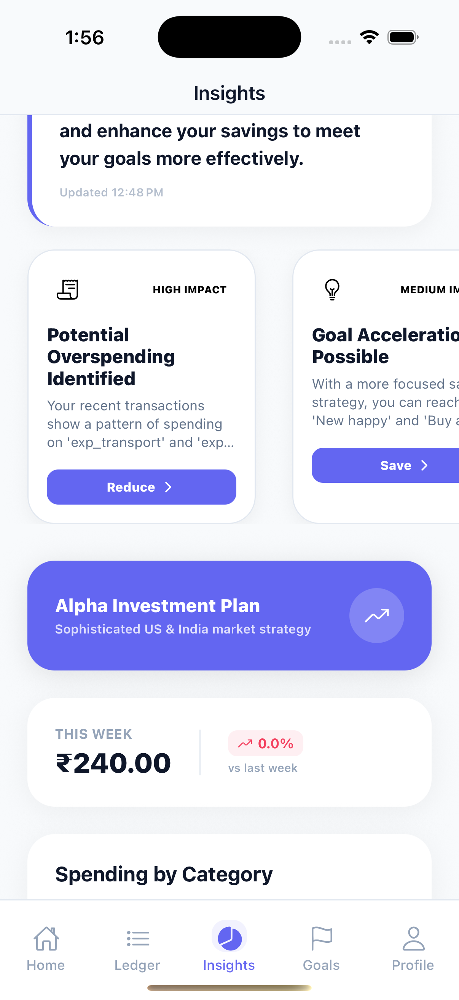 |

| Goals                               | Profile                                 | Home (Scrolled)                                   |
| ----------------------------------- | --------------------------------------- | ------------------------------------------------- |
| 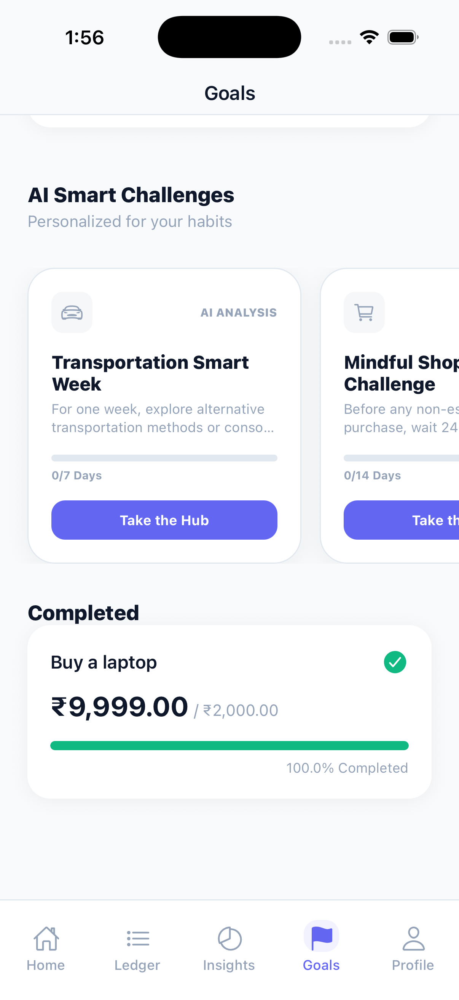 | 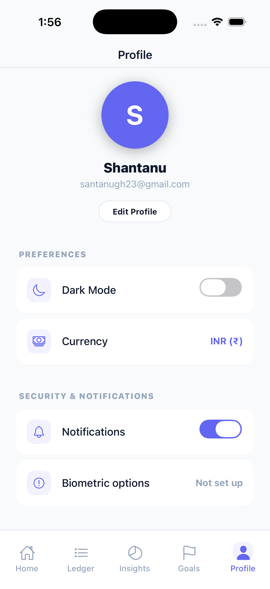 | 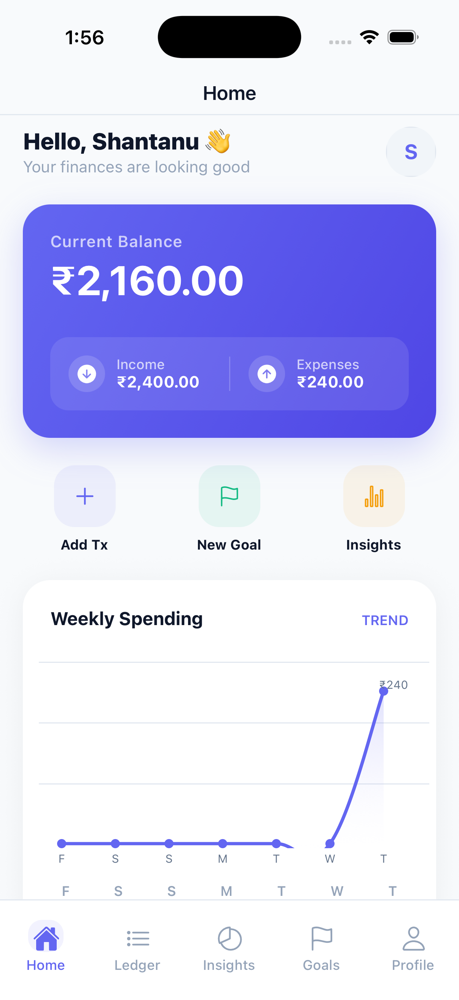 |

### Dark Theme

| Home                            | Ledger                              | Insights                                |
| ------------------------------- | ----------------------------------- | --------------------------------------- |
| 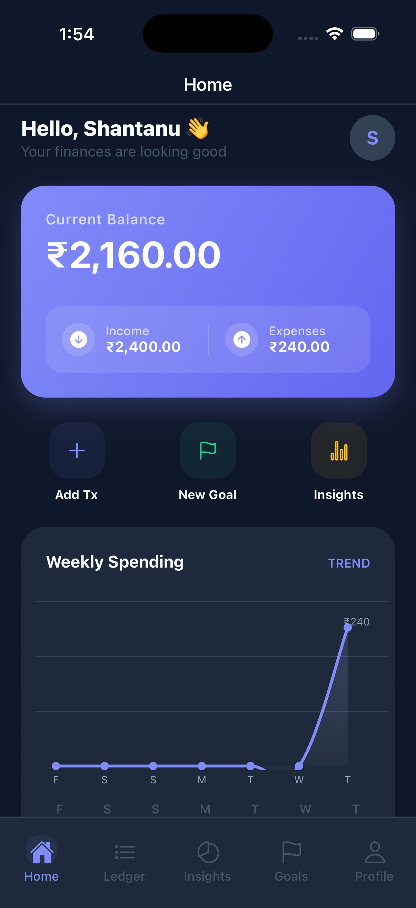 | 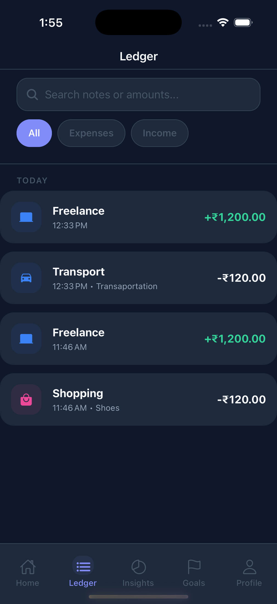 | 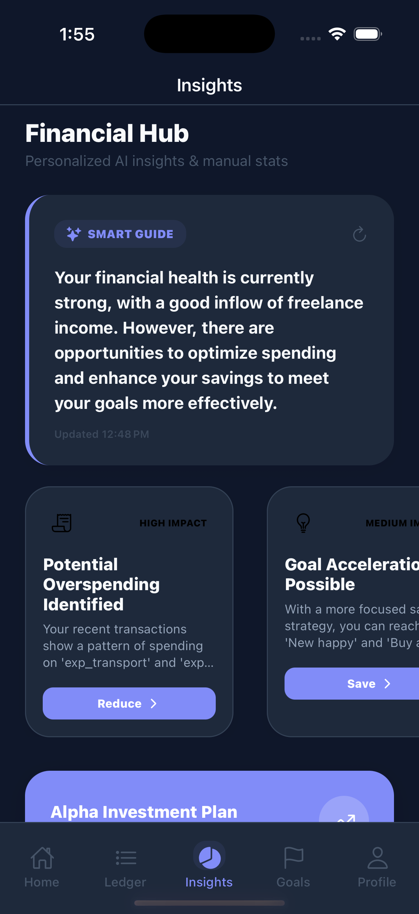 |

| Goals                             | Profile                               | Investment Plan                                   |
| --------------------------------- | ------------------------------------- | ------------------------------------------------- |
| 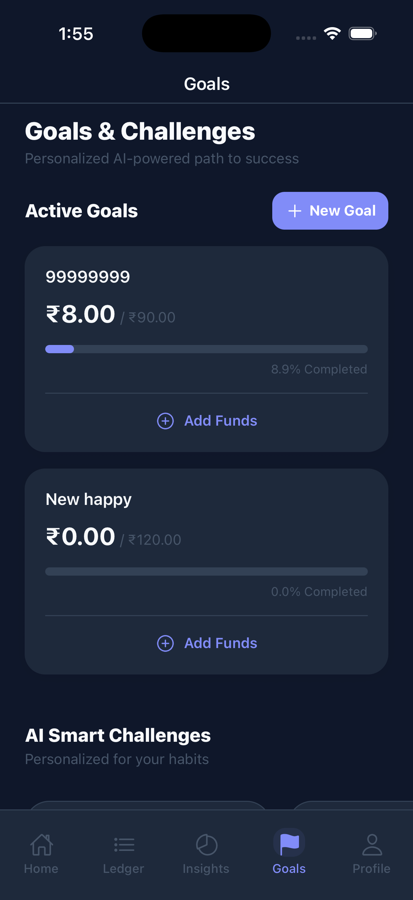 | 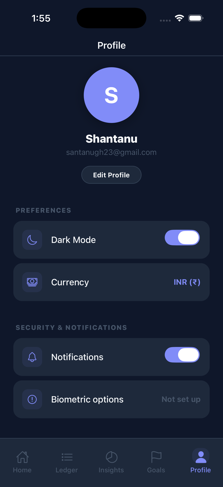 | 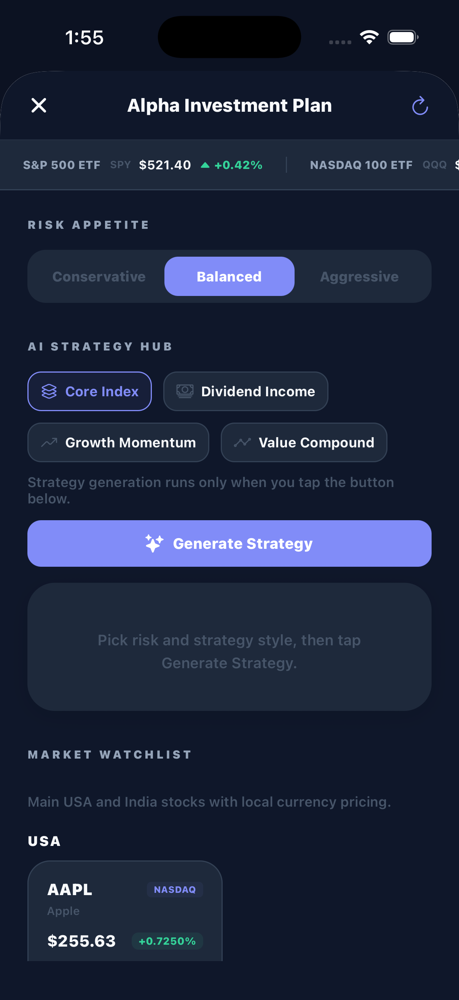 |

| Investment Plan (Scrolled)                                      | Home (Scrolled)                                   | Goals (Scrolled)                                    |
| --------------------------------------------------------------- | ------------------------------------------------- | --------------------------------------------------- |
| 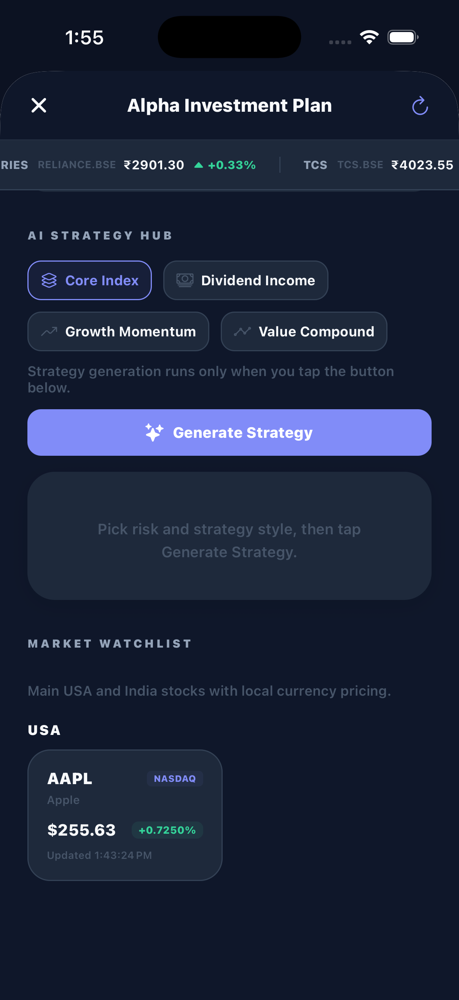 | 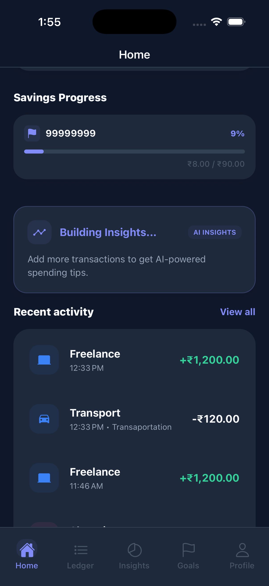 | 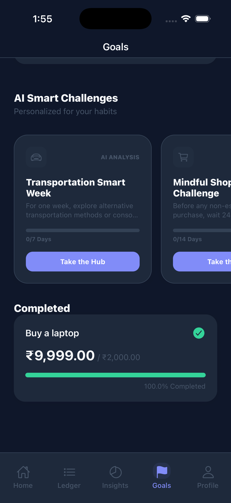 |

### Export Flow

| CSV Sharing Sheet                              |
| ---------------------------------------------- |
| 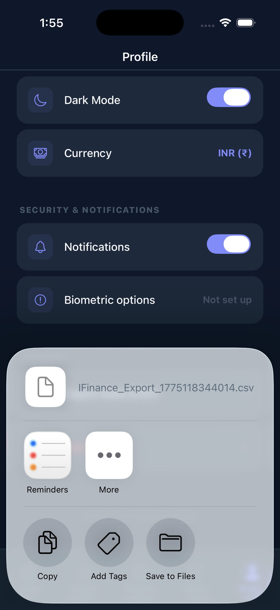 |

## Tech Stack

- Framework: Expo, React Native, expo-router
- Language: TypeScript
- State: Zustand + AsyncStorage persistence
- Auth: Firebase Auth + expo-local-authentication
- Motion and gestures: react-native-reanimated, react-native-gesture-handler
- Charts: react-native-gifted-charts
- Notifications and sharing: expo-notifications, expo-sharing

## Project Layout

```text
app/                Screens and route layouts (expo-router)
components/         Reusable UI and feature components
constants/          Theme tokens and static constants
hooks/              Cross-cutting hooks (biometrics, notifications, theme)
services/           AI and market data services
store/              Zustand stores for auth, finance, and settings
types/              Shared TypeScript types
utils/              Utility helpers and export functions
img/                App screenshots (light and dark)
```

## Getting Started

### Prerequisites

- Node.js 18+
- npm
- Xcode (for iOS builds on macOS)
- Android Studio (for Android builds)

### Install

```bash
npm install
```

### Run

```bash
npm run start
```

```bash
npm run ios
```

```bash
npm run android
```

## Notes for Setup

- Firebase app files are required for device builds.
- Biometric lock features require hardware support and enrolled biometrics on the test device.
- Market data relies on external APIs and may be rate-limited depending on provider limits.

## License

This project is currently maintained as a personal/portfolio codebase. Add a license file if you plan to distribute it.
